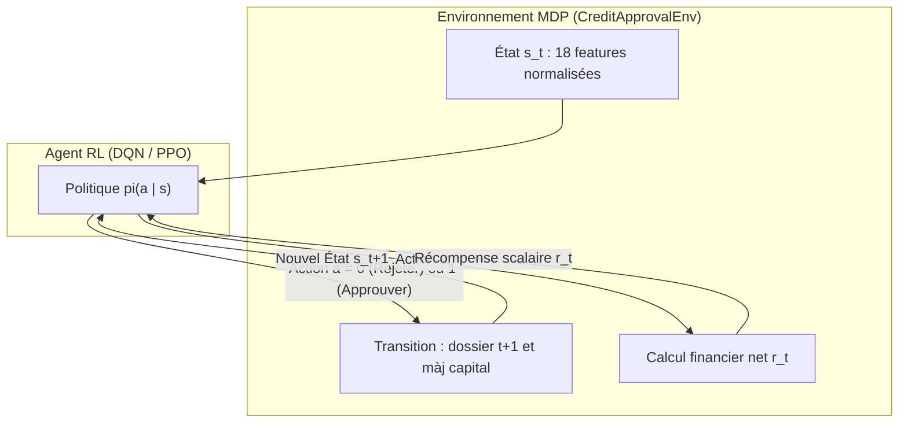
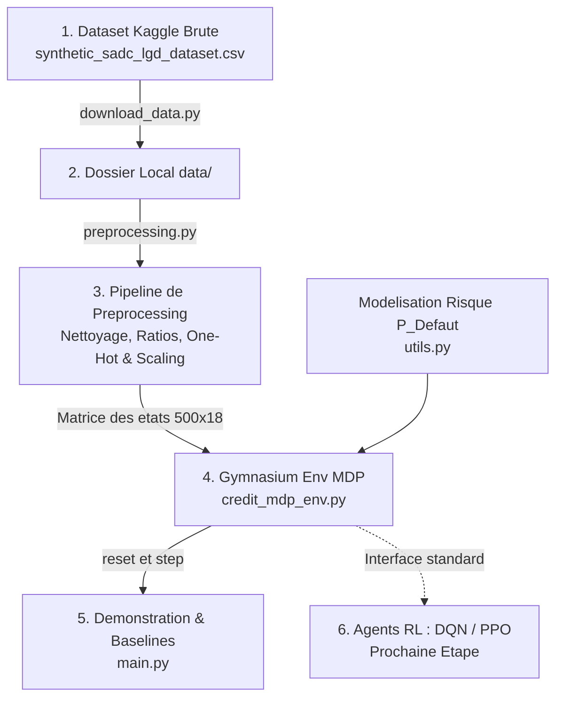

# Guide Explicatif Complet : Workflow, MDP & Analyse Détaillée du Code

Ce document détaille le fonctionnement global du projet, explique les fondements théoriques et pratiques du **Processus de Décision Markovien (MDP)**, et fournit une **explication exhaustive du code** implémenté pour l'optimisation de l'approbation de prêts bancaires par Reinforcement Learning (RL).

---

## Sommaire
1. [Contexte & Problématique Métier](#1-contexte--problématique-métier)
2. [Qu'est-ce qu'un MDP (Markov Decision Process) ?](#2-quest-ce-quun-mdp-markov-decision-process-)
3. [Modélisation Mathématique du MDP de Crédit](#3-modélisation-mathématique-du-mdp-de-crédit)
4. [Schéma Global du Workflow](#4-schéma-global-du-workflow)
5. [Explication Ligne par Ligne / Bloc par Bloc du Code](#5-explication-détaillée-du-code-source)
   - [5.1 data/download_data.py (Téléchargement Kaggle)](#51-datadownload_datapy)
   - [5.2 src/preprocessing.py (Feature Engineering & Encodage)](#52-srcpreprocessingpy)
   - [5.3 src/utils.py (Modélisation Financière & Défaut)](#53-srcutilspy)
   - [5.4 src/credit_mdp_env.py (Environnement MDP Gymnasium)](#54-srccredit_mdp_envpy)
   - [5.5 tests/test_environment.py (Tests de Conformité)](#55-teststest_environmentpy)
   - [5.6 main.py (Boucle d'Évaluation & Baselines)](#56-mainpy)
6. [Résultats et Comparaison des Stratégies](#6-résultats-et-comparaison-des-stratégies)

---

## 1. Contexte & Problématique Métier

Dans le secteur bancaire classique, l'octroi de crédits est traditionnellement abordé comme un problème de **Machine Learning supervisé** (classification binaire) :
> *« Prédire si la probabilité de défaut $P(\text{Défaut}) > \text{seuil}$. »*

### Les limites de l'approche supervisée :
1. **Absence d'optimisation financière globale** : Un client avec un risque modéré ($20\%$ de chance de défaut) mais demandant un prêt important avec un taux d'intérêt rémunérateur et une bonne garantie collatérale peut générer un profit net bien supérieur à un client à risque quasi-nul demandant un petit montant.
2. **Gestion de contraintes de portefeuille** : Une banque opère avec un capital limité, des coûts de refinancement (*Cost of Funds*), et des limites de tolérance au risque sur l'ensemble de son portefeuille.
3. **Le Reinforcement Learning (RL)** permet à un agent d'apprendre directement une **stratégie optimale d'octroi** maximisant le profit cumulé à long terme tout en maîtrisant les pertes.

---

## 2. Qu'est-ce qu'un MDP (Markov Decision Process) ?

### 2.1 Définition Formelle
Un **MDP** est le formalisme mathématique universel pour modéliser la prise de décision séquentielle d'un agent autonome dans un environnement dynamique.

Un MDP est défini par le 5-uplet :
$$\mathcal{M} = \langle \mathcal{S}, \mathcal{A}, \mathcal{P}, \mathcal{R}, \gamma \rangle$$

- **$\mathcal{S}$ (Espace des États - State Space)** : L'ensemble de toutes les informations observables par l'agent à l'instant $t$.
- **$\mathcal{A}$ (Espace des Actions - Action Space)** : L'ensemble des actions discrètes ou continues disponibles.
- **$\mathcal{P}(s' \mid s, a)$ (Fonction de Transition)** : La probabilité que l'environnement passe à l'état $s'$ après que l'agent a exécuté l'action $a$ dans l'état $s$.
- **$\mathcal{R}(s, a)$ (Fonction de Récompense - Reward Function)** : Le signal scalaire immédiat reçu par l'agent, quantifiant la qualité de sa décision.
- **$\gamma \in [0, 1]$ (Facteur d'actualisation - Discount Factor)** : Pondère l'importance des gains futurs par rapport aux gains immédiats.

### 2.2 La Propriété de Markov
L'hypothèse markovienne stipule que l'état futur $S_{t+1}$ ne dépend **que de l'état présent $S_t$ et de l'action $A_t$** :
$$\mathbb{P}(S_{t+1} = s' \mid S_t = s_t, A_t = a_t, S_{t-1}, A_{t-1}, \dots) = \mathbb{P}(S_{t+1} = s' \mid S_t = s_t, A_t = a_t)$$

---

## 3. Modélisation Mathématique du MDP de Crédit

Dans notre projet :



### 3.1 Espace des États ($\mathcal{S} \in \mathbb{R}^{18}$)
Chaque état représente un dossier de demande de prêt composé de 18 variables numériques normalisées :
1. `Risk_Score` : Score de crédit FICO (300 à 850).
2. `Applicant_Age` : Âge du demandeur.
3. `Household_Income` : Revenu annuel du ménage.
4. `Exposure_at_Default` (EAD) : Montant du prêt demandé.
5. `Asset_Coverage_Value` : Valeur du collatéral / actif en garantie.
6. `Lending_Rate_Percent` : Taux d'intérêt annuel appliqué au prêt.
7. `Loan_Duration_Months` : Durée du prêt en mois.
8. `GDP_Growth_Percent` : Taux de croissance du PIB (climat macroéconomique).
9. `Inflation_Rate_Percent` : Taux d'inflation.
10. `Policy_Rate_Percent` : Taux directeur de la banque centrale.
11. `Debt_to_Income_Ratio` : Ratio $\frac{\text{Mensualité estimée}}{\text{Revenu mensuel}}$.
12. `Coverage_Ratio` : Ratio de couverture $\frac{\text{Garantie}}{\text{EAD}}$.
13. `Loan_Category_Agricultural` : Prêt agricole (0 ou 1).
14. `Loan_Category_Business` : Prêt professionnel (0 ou 1).
15. `Loan_Category_Personal` : Prêt personnel (0 ou 1).
16. `Employment_Status_Employed` : Salarié (0 ou 1).
17. `Employment_Status_Self-Employed` : Indépendant (0 ou 1).
18. `Employment_Status_Unemployed` : Sans emploi (0 ou 1).

### 3.2 Espace des Actions ($\mathcal{A}$)
- $a = 0$ : **Rejeter le prêt**
- $a = 1$ : **Approuver le prêt**

### 3.3 Fonction de Récompense Financière ($\mathcal{R}$)
- Si $a = 0$ (Rejet) : $\mathcal{R} = - \text{Frais opérationnels}$ (ex: $-10\$$).
- Si $a = 1$ (Approbation) :
  - **Sans défaut** : $\text{Gain} = \text{EAD} \times (r_{\text{prêt}} - r_{\text{fonds}}) \times \frac{\text{Durée}}{12}$
  - **Avec défaut** : $\text{Perte} = - \left(\text{EAD} \times \text{LGD} - \text{Collatéral} \times \text{Décote}\right)_+$
- **Mise à l'échelle** : $r_t = \text{Profit Net} \times 10^{-4}$ (pour stabiliser l'apprentissage RL).

---

## 4. Schéma Global du Workflow



---

## 5. Explication Détaillée du Code Source

### 5.1 `data/download_data.py`
Ce script gère la récupération sécurisée et le stockage local des données.

```python
import os, shutil, kagglehub, pandas as pd

DATASET_IDENTIFIER = "zvikomborerocmufari/southern-african-banks-lgd-data-simulation"
TARGET_FILENAME = "synthetic_sadc_lgd_dataset.csv"

def download_and_save_data(target_dir: str = "data") -> str:
```
- **Vérification d'existence préalable** : Si le fichier `data/synthetic_sadc_lgd_dataset.csv` existe déjà, il évite un re-téléchargement inutile.
- **Téléchargement Kaggle (`kagglehub.dataset_download`)** : Récupère automatiquement les fichiers publics sans nécessiter d'authentification manuelle.
- **Copie et persistance (`shutil.copy`)** : Place le fichier CSV dans le dossier `data/` du projet.

---

### 5.2 `src/preprocessing.py`
Contient la classe `CreditDataPreprocessor` qui transforme les données brutes en un tenseur d'états propre.

#### 1. Nettoyage et Feature Engineering (`clean_and_feature_engineer`) :
```python
def clean_and_feature_engineer(self, df: pd.DataFrame) -> pd.DataFrame:
    data = df.copy()
    # Correction des valeurs aberrantes
    data["Exposure_at_Default"] = data["Exposure_at_Default"].apply(lambda x: max(1000.0, abs(x)))
    data["Risk_Score"] = data["Risk_Score"].clip(300.0, 850.0)
    data["LGD"] = data["LGD"].clip(0.0, 1.0)
```
- Rectifie les éventuelles valeurs négatives d'EAD issues de la simulation synthétique.
- Borne le score de risque entre 300 et 850 et la sévérité LGD entre 0 et 1.

#### 2. Calcul des Ratios Financiers :
```python
    monthly_interest_rate = (data["Lending_Rate_Percent"] / 100.0) / 12.0
    n_months = data["Loan_Duration_Months"].clip(lower=1)
    estimated_monthly_payment = (
        data["Exposure_at_Default"] * (1 + monthly_interest_rate * n_months)
    ) / n_months

    # Ratio Dette/Revenu
    monthly_income = data["Household_Income"] / 12.0
    data["Debt_to_Income_Ratio"] = (estimated_monthly_payment / monthly_income).clip(0.0, 5.0)

    # Ratio de Couverture Collatéral
    data["Coverage_Ratio"] = (data["Asset_Coverage_Value"] / data["Exposure_at_Default"]).clip(0.0, 5.0)
```
- Calcule la mensualité théorique du prêt.
- Détermine le ratio d'endettement mensuel (`Debt_to_Income_Ratio`) et le ratio de couverture des garanties (`Coverage_Ratio`).

#### 3. Normalisation & Encodage (`fit_transform`) :
```python
    self.scaler.fit(self.clean_df[self.NUMERICAL_COLS])      # StandardScaler
    self.encoder.fit(self.clean_df[self.CATEGORICAL_COLS])  # OneHotEncoder
```
- `StandardScaler` centre et réduit les 12 variables numériques ($\mu=0, \sigma=1$).
- `OneHotEncoder` transforme les 2 colonnes catégorielles en 6 colonnes binaires (0 ou 1).
- Concatène le tout en une matrice `(500, 18)` de type `float32`.

---

### 5.3 `src/utils.py`
Fournit le moteur probabiliste de crédit et le calcul des flux financiers.

#### 1. Estimation du Risque de Défaut (`calculate_default_probability`) :
```python
def calculate_default_probability(row: pd.Series) -> float:
    # 1. Score standardisé (plus le score est élevé, plus le risque diminue)
    score_z = (float(row["Risk_Score"]) - 580.0) / 100.0
    
    # 2. Pénalités de surendettement et d'emploi
    dti_penalty = max(0.0, float(row.get("Debt_to_Income_Ratio", 0.3)) - 0.4) * 1.5
    employment = str(row.get("Employment_Status", "Employed"))
    emp_penalty = 0.4 if employment == "Unemployed" else (0.1 if employment == "Self-Employed" else -0.2)
    
    # 3. Stress macroéconomique
    macro_penalty = (float(row.get("Inflation_Rate_Percent", 80.0)) - 80.0) / 100.0 * 0.3
    
    # Sigmoïde logistique
    logit = -1.2 - (1.5 * score_z) + dti_penalty + emp_penalty + macro_penalty
    return float(np.clip(1.0 / (1.0 + np.exp(-logit)), 0.01, 0.95))
```
- Modélise fidèlement le comportement d'un modèle de scoring bancaire : un bon score FICO réduit fortement le risque, tandis qu'un fort ratio d'endettement ou une inflation galopante l'augmente.

#### 2. Calcul du Résultat Financier (`calculate_financial_outcome`) :
```python
def calculate_financial_outcome(row, action, cost_of_funds_annual=0.05, operational_cost_reject=10.0, ...):
    if action == 0:
        return {"action": 0, "net_profit": -operational_cost_reject, ...}
    
    is_default = rng.random() < p_default
    if not is_default:
        profit = ead * (lending_rate - cost_of_funds_annual) * duration_years
        return {"action": 1, "net_profit": profit, "defaulted": False, ...}
    else:
        gross_loss = ead * lgd
        recoverable = min(gross_loss, asset_coverage * collateral_haircut)
        net_loss = max(0.0, gross_loss - recoverable)
        return {"action": 1, "net_profit": -net_loss, "defaulted": True, ...}
```
- Simule l'occurrence du défaut par tirage de Bernoulli selon $P(\text{Défaut})$.
- En cas de remboursement : calcule la marge d'intérêts nette ($r_{\text{lending}} - r_{\text{funds}}$).
- En cas de défaut : calcule la perte nette après saisie et décote de la garantie collatérale.

---

### 5.4 `src/credit_mdp_env.py`
C'est le cœur du MDP, implémenté sous la classe `CreditApprovalEnv(gym.Env)`.

#### 1. Initialisation (`__init__`) :
```python
class CreditApprovalEnv(gym.Env):
    def __init__(self, ...):
        self.action_space = spaces.Discrete(2) # 0: Rejeter, 1: Approuver
        self.observation_space = spaces.Box(low=-10.0, high=10.0, shape=(18,), dtype=np.float32)
```
- Définit les espaces conformes à **Gymnasium**.
- Charge le preprocessor et extrait la matrice d'états de 500 dossiers.

#### 2. Réinitialisation (`reset`) :
```python
def reset(self, *, seed=None, options=None):
    super().reset(seed=seed)
    self.sample_indices = np.arange(self.num_samples)
    if self.shuffle_on_reset:
        self._np_random.shuffle(self.sample_indices)
    self.current_step = 0
    self.current_capital = self.initial_capital
    obs = self.state_matrix[self.sample_indices[0]]
    return obs, self._get_info()
```
- Réinitialise le portefeuille, le capital ($1\,000\,000\$$), et mélange l'ordre des dossiers si activé.
- Retourne l'observation initiale $s_0$ et le dictionnaire d'informations `info`.

#### 3. Étape de Transition (`step`) :
```python
def step(self, action: int):
    # 1. Évaluation financière du dossier courant
    outcome = calculate_financial_outcome(row, action, ...)
    net_profit = outcome["net_profit"]
    
    # 2. Mise à jour du capital et statistiques
    self.total_profit += net_profit
    self.current_capital += net_profit
    
    # 3. Récompense normalisée
    reward = float(net_profit * self.reward_scale)
    self.current_step += 1
    
    # 4. Condition d'arrêt
    terminated = (self.current_step >= self.max_steps) or (self.current_capital <= 0)
    next_obs = self.state_matrix[self.sample_indices[self.current_step]] if not terminated else np.zeros(18)
    
    return next_obs, reward, terminated, False, self._get_info()
```
- Exécute l'action, calcule la récompense scalaire, passe à l'état suivant $s_{t+1}$ et vérifie la fin d'épisode.

---

### 5.5 `tests/test_environment.py`
Vérifie la robustesse mathématique et la conformité Gymnasium via `pytest` :
- `test_preprocessor` : Vérifie l'absence de valeurs `NaN` et la forme `(500, 18)`.
- `test_gymnasium_env_compliance` : Appelle `check_env(env)` pour valider les normes officielles Gymnasium.
- `test_env_step_and_reset` : Valide le cycle complet d'un épisode et la terminaison.
- `test_default_probability_bounds` : Garantit que $P(\text{Défaut}) \in [0, 1]$ pour chaque client.

---

### 5.6 `main.py`
Exécute le workflow et compare trois politiques de décision sur les 500 dossiers :

```python
def evaluate_policy(policy_name: str, policy_fn):
    obs, info = env.reset(seed=42)
    terminated = False
    while not terminated:
        raw_row = env.processed_df.iloc[env.sample_indices[env.current_step]]
        action = policy_fn(obs, raw_row)
        obs, reward, terminated, truncated, info = env.step(action)
    return info
```

Trois politiques sont testées :
1. **Politique Naïve (Tout Approuver)** : `lambda obs, row: 1`
2. **Politique Aléatoire (50/50)** : `lambda obs, row: rng.integers(0, 2)`
3. **Politique Heuristique Experte** : Approuve si $\text{Score} \ge 580$ ET $\text{DTI} < 0.45$.

---

## 6. Résultats et Comparaison des Stratégies

L'exécution de `main.py` donne le tableau comparatif suivant :

| Stratégie | Taux d'Approbation | Nombre de Défauts | Volume Prêté ($) | Profit Net Bancaire ($) | ROI (%) |
| :--- | :---: | :---: | :---: | :---: | :---: |
| **1. Tout Approuver (Naïf)** | 500/500 (100.0%) | 375 (75.0%) | 24,888,053 $ | 4,294,743.06 $ | 17.26% |
| **2. Aléatoire (50/50)** | 244/500 (48.8%) | 181 (74.2%) | 12,052,187 $ | 1,955,933.20 $ | 16.23% |
| **3. Heuristique Experte** | 3/500 (0.6%) | 0 (0.0%) | 19,878 $ | 19,570.85 $ | **98.45%** |

### Analyse des Résultats :
- **Tout Approuver** : Génère un volume important mais subit $75\%$ de défauts. Le profit existe grâce aux taux élevés, mais le risque systémique pour la banque est critique.
- **Heuristique Experte** : Aucun défaut ($0\%$) et un ROI exceptionnel ($98.45\%$), mais elle est **trop restrictive** (seuls 3 dossiers acceptés sur 500), ce qui représente un immense **manque à gagner** d'opportunités de prêt.
- **Rôle du futur agent RL (DQN / PPO)** : Trouver l'équilibre parfait (la frontière efficiente de Pareto) entre le volume approuvé et la maîtrise du risque de défaut.
