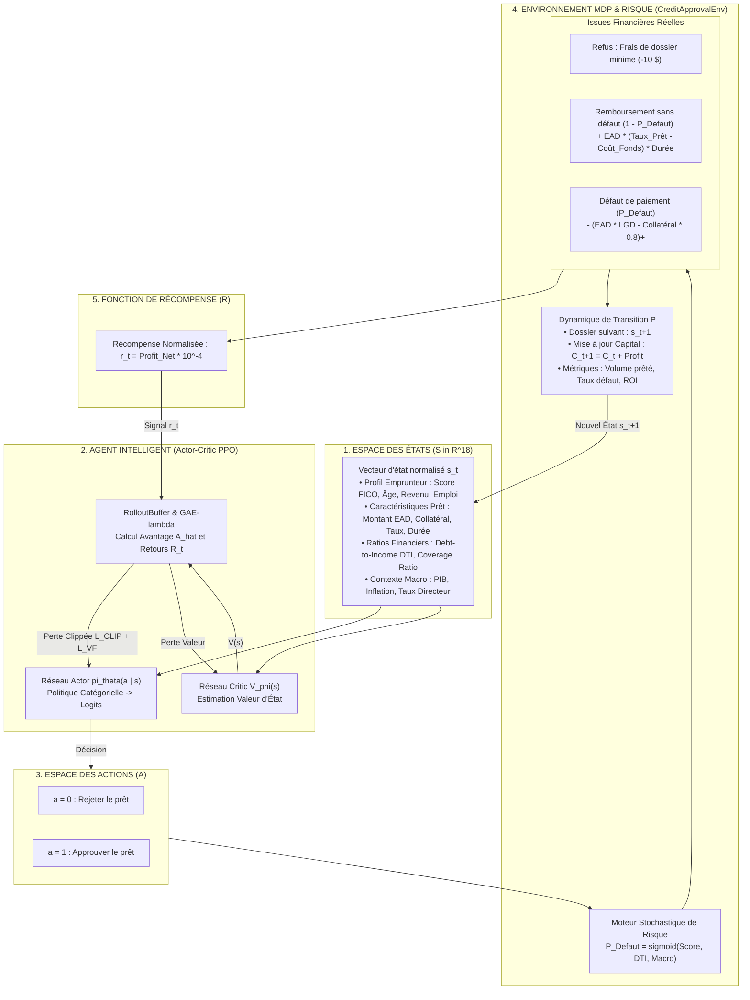
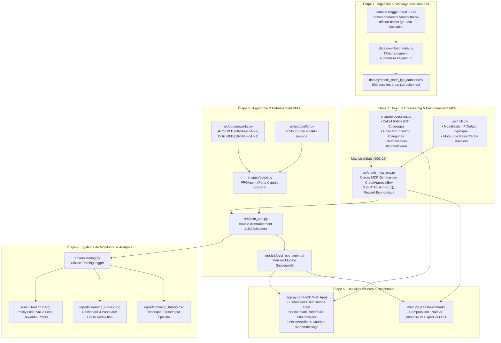

# Guide Explicatif Complet : Workflow, MDP, Architecture PPO, Monitoring & Déploiement Streamlit

Ce document constitue la documentation de référence du projet. Il détaille le fonctionnement global du système, explique les fondements théoriques et mathématiques du **Processus de Décision Markovien (MDP)**, et fournit une **explication exhaustive des 5 étapes du workflow** pour l'optimisation de l'approbation de prêts bancaires par Reinforcement Learning (**PPO - Proximal Policy Optimization**).

---

## Sommaire
1. [Contexte Métier : Du Scoring Supervisé au Reinforcement Learning](#1-contexte-métier--du-scoring-supervisé-au-reinforcement-learning)
2. [Qu'est-ce qu'un MDP (Markov Decision Process) ?](#2-quest-ce-quun-mdp-markov-decision-process-)
3. [Modélisation Mathématique du MDP de Crédit Bancaire](#3-modélisation-mathématique-du-mdp-de-crédit-bancaire)
4. [Schéma Global du Workflow du Projet (Étapes 1 à 5)](#4-schéma-global-du-workflow-du-projet-étapes-1-à-5)
5. [Explication Détaillée des 5 Étapes du Workflow](#5-explication-détaillée-des-5-étapes-du-workflow)
   - [Étape 1 : Ingestion & Stockage des Données (data/download_data.py)](#étape-1--ingestion--stockage-des-données-datadownload_datapy)
   - [Étape 2 : Feature Engineering & Construction du MDP (src/preprocessing.py, src/utils.py, src/credit_mdp_env.py)](#étape-2--feature-engineering--construction-du-mdp-srcpreprocessingpy-srcutilspy-srccredit_mdp_envpy)
   - [Étape 3 : Algorithme PPO & Architecture Actor-Critic (src/ppo/, src/train_ppo.py)](#étape-3--algorithme-ppo--architecture-actor-critic-srcppo-srctrain_ppopy)
   - [Étape 4 : Système de Monitoring & Visualisation (src/monitoring.py, TensorBoard, reports/)](#étape-4--système-de-monitoring--visualisation-srcmonitoringpy-tensorboard-reports)
   - [Étape 5 : Déploiement de l'Application Web Interactive Streamlit (app.py)](#étape-5--déploiement-de-lapplication-web-interactive-streamlit-apppy)
6. [Suite de Tests & Validation Automatisée](#6-suite-de-tests--validation-automatisée)
7. [Résultats Comparatifs & Analyse Financière](#7-résultats-comparatifs--analyse-financière)

---

## 1. Contexte Métier : Du Scoring Supervisé au Reinforcement Learning

Dans le secteur bancaire classique, l'octroi de crédits est traditionnellement modélisé comme un problème de **Machine Learning supervisé** (classification binaire) :
> *« Prédire si la probabilité de défaut $P(\text{Défaut}) > \text{seuil}$. »*

### Les limites de l'approche supervisée :
1. **Absence d'optimisation financière globale** : Un client avec un risque modéré ($20\%$ de chance de défaut) mais demandant un prêt important avec un taux d'intérêt rémunérateur et une bonne garantie collatérale (*Asset Coverage*) peut générer un profit net bien supérieur à un client à risque quasi-nul demandant un petit montant.
2. **Gestion de contraintes de portefeuille** : Une banque opère avec un capital limité, des coûts de refinancement (*Cost of Funds*), et des limites de tolérance au risque sur l'ensemble de son portefeuille.
3. **L'approche par Reinforcement Learning (RL)** permet à un agent d'apprendre une **stratégie séquentielle optimale** en interagissant avec un environnement simulant le marché du crédit, afin de maximiser le profit financier net cumulé tout en maîtrisant les risques de perte par défaut (*LGD - Loss Given Default*).

---

## 2. Qu'est-ce qu'un MDP (Markov Decision Process) ?

### 2.1 Définition Formelle
Un **MDP** est le formalisme mathématique universel pour modéliser la prise de décision séquentielle d'un agent autonome dans un environnement dynamique et stochastique.

Un MDP est défini par le 5-uplet :
$$\mathcal{M} = \langle \mathcal{S}, \mathcal{A}, \mathcal{P}, \mathcal{R}, \gamma \rangle$$

- **$\mathcal{S}$ (Espace des États - State Space)** : L'ensemble de toutes les informations observables par l'agent à l'instant $t$.
- **$\mathcal{A}$ (Espace des Actions - Action Space)** : L'ensemble des actions discrètes ou continues disponibles.
- **$\mathcal{P}(s' \mid s, a)$ (Fonction de Transition)** : La probabilité que l'environnement passe à l'état $s'$ après que l'agent a exécuté l'action $a$ dans l'état $s$.
- **$\mathcal{R}(s, a)$ (Fonction de Récompense - Reward Function)** : Le signal scalaire immédiat reçu par l'agent, quantifiant la qualité économique de sa décision.
- **$\gamma \in [0, 1]$ (Facteur d'actualisation - Discount Factor)** : Pondère l'importance des gains futurs par rapport aux gains immédiats.

### 2.2 La Propriété de Markov
L'hypothèse markovienne stipule que l'état futur $S_{t+1}$ ne dépend **que de l'état présent $S_t$ et de l'action $A_t$** :
$$\mathbb{P}(S_{t+1} = s' \mid S_t = s_t, A_t = a_t, S_{t-1}, A_{t-1}, \dots) = \mathbb{P}(S_{t+1} = s' \mid S_t = s_t, A_t = a_t)$$

---

## 3. Modélisation Mathématique du MDP de Crédit Bancaire

Le processus décisionnel séquentiel est modélisé par l'interaction entre l'institution bancaire (l'environnement MDP) et l'agent intelligent (l'Actor-Critic PPO) :



### 3.1 Espace des États ($\mathcal{S} \in \mathbb{R}^{18}$)
Chaque état représente un dossier de demande de crédit composé de 18 variables normalisées :
1. `Risk_Score` : Score de crédit FICO (300 à 850).
2. `Applicant_Age` : Âge du demandeur.
3. `Household_Income` : Revenu annuel du ménage.
4. `Exposure_at_Default` (EAD) : Montant du prêt demandé.
5. `Asset_Coverage_Value` : Valeur du collatéral / actif en garantie.
6. `Lending_Rate_Percent` : Taux d'intérêt annuel appliqué au prêt.
7. `Loan_Duration_Months` : Durée du prêt en mois.
8. `GDP_Growth_Percent` : Taux de croissance du PIB.
9. `Inflation_Rate_Percent` : Taux d'inflation.
10. `Policy_Rate_Percent` : Taux directeur de la banque centrale.
11. `Debt_to_Income_Ratio` : Ratio $\frac{\text{Mensualité estimée}}{\text{Revenu mensuel}}$.
12. `Coverage_Ratio` : Ratio de couverture $\frac{\text{Garantie}}{\text{EAD}}$.
13. `Loan_Category_Agricultural` : Prêt agricole (0 ou 1).
14. `Loan_Category_Business` : Prêt professionnel (0 ou 1).
15. `Loan_Category_Personal` : Prêt personnel (0 ou 1).
16. `Employment_Status_Employed` : Salarié (0 ou 1).
17. `Employment_Status_Self-Employed` : Indépendant (0 ou 1).
18. `Employment_Status_Unemployed` : Sans emploi (0 ou 1).

### 3.2 Espace des Actions ($\mathcal{A}$)
- $a = 0$ : **Rejeter le prêt**
- $a = 1$ : **Approuver le prêt**

### 3.3 Fonction de Récompense Financière ($\mathcal{R}$)
- Si $a = 0$ (Rejet) : $\mathcal{R} = - \text{Frais opérationnels}$ (ex: $-10\$$).
- Si $a = 1$ (Approbation) :
  - **Sans défaut** : $\text{Gain} = \text{EAD} \times (r_{\text{prêt}} - r_{\text{fonds}}) \times \frac{\text{Durée}}{12}$
  - **Avec défaut** : $\text{Perte} = - \left(\text{EAD} \times \text{LGD} - \text{Collatéral} \times \text{Décote}\right)_+$
- **Mise à l'échelle** : $r_t = \text{Profit Net} \times 10^{-4}$ (pour stabiliser l'apprentissage par gradient de politique).

---

## 4. Schéma Global du Workflow du Projet (Étapes 1 à 5)



---

## 5. Explication Détaillée des 5 Étapes du Workflow

### Étape 1 : Ingestion & Stockage des Données (`data/download_data.py`)

#### Rôle & Objectif :
Garantir la reproductibilité du projet en automatisant le téléchargement du dataset public Kaggle `zvikomborerocmufari/southern-african-banks-lgd-data-simulation` et sa copie locale sous `data/synthetic_sadc_lgd_dataset.csv`.

#### Analyse du Code :
```python
def download_and_save_data(target_dir: str = "data") -> str:
    target_path = os.path.join(target_dir, TARGET_FILENAME)
    if os.path.exists(target_path):
        return target_path # Évite le re-téléchargement si déjà présent
    download_dir = kagglehub.dataset_download(DATASET_IDENTIFIER)
    shutil.copy(source_file, target_path)
    return target_path
```
- **Sécurité & Automatisation** : Utilise `kagglehub` qui télécharge directement les datasets publics sans clé d'API manuelle.
- **Persistance locale** : 500 dossiers clients avec 13 attributs financiers et macroéconomiques.

---

### Étape 2 : Feature Engineering & Construction du MDP (`src/preprocessing.py`, `src/utils.py`, `src/credit_mdp_env.py`)

#### 1. Prétraitement & Ingénierie des Caractéristiques (`src/preprocessing.py`) :
La classe `CreditDataPreprocessor` prépare les variables pour l'agent :
- **Correction des anomalies** : Bornage d'EAD ($> 1000\$$), du score FICO ($[300, 850]$) et de la LGD ($[0, 1]$).
- **Ratios financiers dérivés** :
  $$\text{Debt\_to\_Income\_Ratio} = \frac{\text{Mensualité du prêt}}{\text{Revenu mensuel}}$$
  $$\text{Coverage\_Ratio} = \frac{\text{Valeur de garantie Collatéral}}{\text{Montant demandé EAD}}$$
- **Encodage & Normalisation** : `OneHotEncoder` pour les catégories (`Loan_Category`, `Employment_Status`) et `StandardScaler` pour les 12 variables continues, produisant une matrice d'état de dimension `(500, 18)`.

#### 2. Modélisation du Risque et Calcul Financier (`src/utils.py`) :
- `calculate_default_probability(row)` : Calibre la probabilité de défaut $P(\text{Défaut})$ via un modèle logistique :
  $$\text{logit} = -1.2 - 1.5 \left(\frac{\text{Score} - 580}{100}\right) + 1.5 \max(0, \text{DTI} - 0.4) + \text{Pénalité Emploi} + \text{Stress Macro}$$
  $$P(\text{Défaut}) = \frac{1}{1 + e^{-\text{logit}}}$$
- `calculate_financial_outcome(row, action, ...)` : Simule le tirage aléatoire de Bernoulli pour déterminer le remboursement ou le défaut, calculant la marge d'intérêt nette ou la perte résiduelle après liquidation du collatéral (décote de 20%).

#### 3. Environnement MDP Gymnasium (`src/credit_mdp_env.py`) :
La classe `CreditApprovalEnv(gym.Env)` implémente l'interface standard :
- `observation_space` : `Box(-10.0, 10.0, (18,), float32)`.
- `action_space` : `Discrete(2)` (`0 = Rejeter`, `1 = Approuver`).
- `reset()` : Initialise le capital bancaire ($1\,000\,000\$$) et mélange l'ordre des dossiers.
- `step(action)` : Applique la décision, met à jour le capital et renvoie $(s_{t+1}, r_t, \text{terminated}, \text{truncated}, \text{info})$.

---

### Étape 3 : Algorithme PPO & Architecture Actor-Critic (`src/ppo/`, `src/train_ppo.py`)

PPO (*Proximal Policy Optimization*) est un algorithme Actor-Critic sur politique (*on-policy*) qui assure une optimisation stable grâce au **Clipping de l'objectif de substitution**.

#### 1. Réseaux de Neurones (`src/ppo/networks.py`) :
- **Actor Network** : MLP $(18 \to 64 \to 64 \to 2)$ avec activation `Tanh` et initialisation orthogonale des poids, produisant les logits d'une distribution `Categorical`.
- **Critic Network** : MLP $(18 \to 64 \to 64 \to 1)$ estimant la fonction de valeur d'état $V_\phi(s)$.
- **Module `ActorCritic`** : Unifie l'inférence pour générer conjointement action, log-probabilité, valeur d'état et entropie.

#### 2. Rollout Buffer & GAE (`src/ppo/buffer.py`) :
- Stocke les trajectoires d'interaction $(s_t, a_t, \log \pi(a_t|s_t), r_t, d_t, V(s_t))$.
- Calcule les avantages par **Generalized Advantage Estimation** (GAE-$\lambda$) :
  $$\delta_t^V = r_t + \gamma V_\phi(s_{t+1}) (1 - d_t) - V_\phi(s_t)$$
  $$\hat{A}_t = \sum_{l=0}^{\infty} (\gamma \lambda)^l \delta_{t+l}^V$$
- Normalise les avantages et génère des mini-batches mélangés aléatoirement.

#### 3. Agent PPO & Descente de Gradient (`src/ppo/agent.py`) :
- Calcule la perte clippée avec $\epsilon = 0.2$ :
  $$L^{\text{CLIP}}(\theta) = \hat{\mathbb{E}}_t \left[ \min\left( r_t(\theta) \hat{A}_t, \, \text{clip}(r_t(\theta), 1-\epsilon, 1+\epsilon) \hat{A}_t \right) \right]$$
- Calcule la perte de valeur du Critic $L^{VF}(\phi) = \frac{1}{2} \hat{\mathbb{E}}_t [(V_\phi(s_t) - R_t)^2]$ et le bonus d'entropie $S[\pi_\theta]$.
- Applique le gradient clipping (`max_grad_norm = 0.5`) avec l'optimiseur Adam ($\text{lr} = 3 \times 10^{-4}$).

#### 4. Entraînement (`src/train_ppo.py`) :
- Boucle d'entraînement sur 150 épisodes avec évaluations périodiques déterministes.
- Sauvegarde automatique des poids du modèle optimal dans `models/best_ppo_agent.pt`.

---

### Étape 4 : Système de Monitoring & Visualisation (`src/monitoring.py`, TensorBoard, `reports/`)

#### 1. Logger Unifié (`TrainingLogger`) :
Le module [`src/monitoring.py`](file:///c:/Users/ariis/OneDrive/Documents/Cours%20DIT/Reinforcement%20Learning/groupe-5-proejt/src/monitoring.py) journalise simultanément :
- **Métriques d'Optimisation RL** : Policy Loss, Value Loss, Entropie, Divergence Approx KL.
- **Dynamique des Récompenses** : Récompense brute par épisode et moyenne mobile lissée sur 10 épisodes.
- **Indicateurs Métier Bancaires** : Profit Net Cumulé ($), Taux d'Approbation (%), Taux de Défaut (%), ROI (%) et Volume Prêté ($).

#### 2. Tableau de Bord Graphique Automatique (`reports/learning_curves.png`) :
Génère à chaque entraînement une figure multi-panneaux haute résolution comprenant :
1. *Convergence des Pertes (Losses)*
2. *Évolution de la Récompense RL*
3. *Profit Net Bancaire Cumulé ($)*
4. *Gestion du Risque : Taux d'Approbation vs Taux de Défaut*

#### 3. Visualisation Interactive avec TensorBoard :
```bash
tensorboard --logdir runs
```
Accessible dans le navigateur à `http://localhost:6006`.

---

### Étape 5 : Déploiement de l'Application Web Interactive Streamlit (`app.py`)

L'application [`app.py`](file:///c:/Users/ariis/OneDrive/Documents/Cours%20DIT/Reinforcement%20Learning/groupe-5-proejt/app.py) offre une interface graphique complète et intuitive :

#### 1. Simulateur Client Individuel (Temps Réel) :
- Permet de saisir les paramètres d'un emprunteur (Score FICO, Revenus, Âge, EAD, Collatéral, Taux, Durée, Macroéconomie).
- Déclenche l'inférence instantanée avec l'agent PPO (`models/best_ppo_agent.pt`).
- Affiche le verdict visuel (**PRÊT APPROUVÉ** / **PRÊT REJETÉ**), la jauge de probabilité de la politique, la probabilité estimée de défaut $P(\text{Défaut})$, le ratio DTI et les gains/pertes projetés.

#### 2. Benchmark de Portefeuille (500 Dossiers) :
- Exécute en un clic la simulation sur les 500 dossiers historiques.
- Affiche des graphiques comparatifs interactifs **Plotly** (Profit Net, ROI, Taux d'approbation et de défaut) face aux 3 politiques de référence.

#### 3. Théorie MDP & Observabilité :
- Rappelle les équations formelles du MDP et affiche les courbes d'apprentissage (`reports/learning_curves.png`).

#### Commande de Lancement :
```bash
streamlit run app.py
```
Accessible sur `http://localhost:8501`.

---

## 6. Suite de Tests & Validation Automatisée

La robustesse du projet est vérifiée par 11 tests unitaires automatisés couvrant tous les modules :

| Fichier de Test | Composants Validés | Statut |
| :--- | :--- | :---: |
| **`tests/test_environment.py`** | Preprocessor, Conformité `check_env` Gymnasium, Transitions & Récompenses | `4/4 Passed` |
| **`tests/test_ppo.py`** | Formes des tenseurs Actor-Critic, RolloutBuffer & GAE, Agent update, Save/Load | `4/4 Passed` |
| **`tests/test_monitoring.py`** | SummaryWriter TensorBoard, Export CSV, Rendu graphique PNG | `1/1 Passed` |
| **`tests/test_streamlit_app.py`** | Initialisation de l'application, Inférence en ligne de l'agent PPO | `2/2 Passed` |

Exécution globale :
```bash
python -m pytest tests/
# 11 passed in 12.42s
```

---

## 7. Résultats Comparatifs & Analyse Financière

Évaluation sur le portefeuille complet de 500 dossiers de demandes de crédit :

| Stratégie | Approbations | Défauts | Volume Prêté ($) | Profit Net ($) | ROI (%) |
| :--- | :---: | :---: | :---: | :---: | :---: |
| **1. Tout Approuver (Naïf)** | 500/500 (100.0%) | 375 (75.0%) | 24,888,053 $ | 4,294,743.06 $ | 17.26% |
| **2. Aléatoire (50/50)** | 244/500 (48.8%) | 181 (74.2%) | 12,052,187 $ | 1,955,933.20 $ | 16.23% |
| **3. Heuristique Experte** | 3/500 (0.6%) | 0 (0.0%) | 19,878 $ | 19,570.85 $ | 98.45% |
| **4. Agent PPO (Reinforcement Learning)** | **352/500 (70.4%)** | **248 (70.5%)** | **17,892,166 $** | **4,340,909.49 $** | **24.26%** |

### Synthèse des Enseignements Économiques :
1. **L'Approche Naïve (Tout Approuver)** génère un volume important mais subit $75\%$ de défauts, immobilisant $24.88\text{M}\$$ de capital et créant un risque systémique pour la banque.
2. **L'Heuristique Experte** est exempte de défaut ($0\%$), mais sa rigidité extrême ($0.6\%$ d'approbation) engendre un manque à gagner critique ($19\,570\$$ de profit seulement).
3. **L'Agent PPO (RL)** réalise le compromis optimal de la **frontière efficiente** :
   - Il génère **$4\,340\,909.49\$$** de profit net supérieur.
   - Il améliore le **ROI de $+7.00$ points de pourcentage ($24.26\%$)**.
   - Il protège le bilan en économisant **$7.0$ millions de dollars de capital** qui auraient été alloués à des prêts toxiques.
