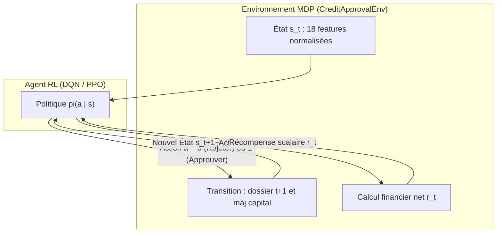
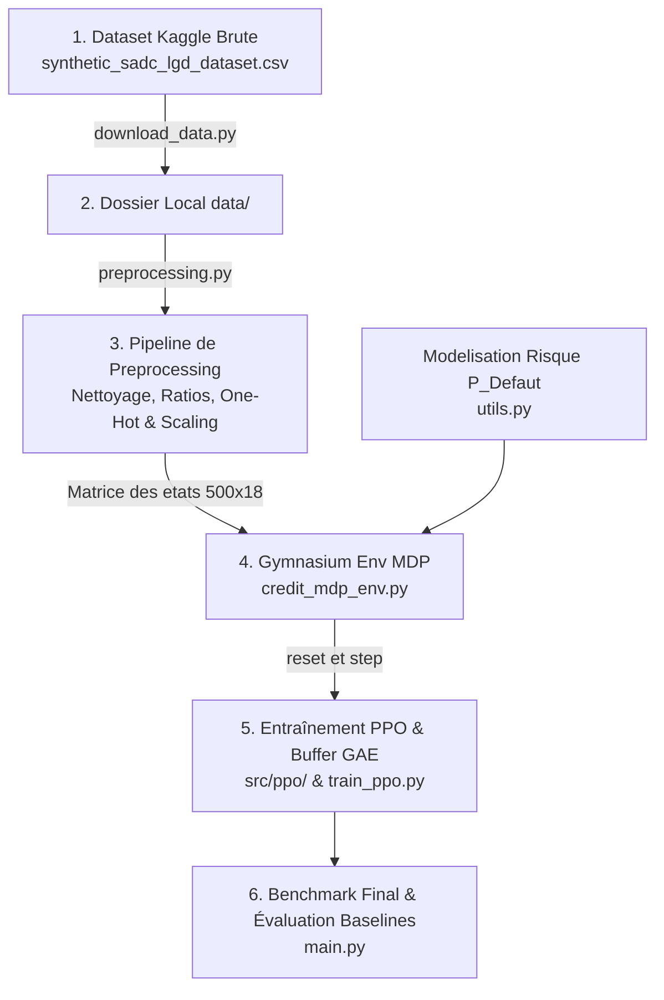

# Guide Explicatif Complet : Workflow, MDP, Architecture PPO & Analyse Détaillée du Code

Ce document détaille le fonctionnement global du projet, explique les fondements théoriques et pratiques du **Processus de Décision Markovien (MDP)**, et fournit une **explication exhaustive du code** implémenté pour l'optimisation de l'approbation de prêts bancaires par Reinforcement Learning (**Proximal Policy Optimization - PPO**).

---

## Sommaire
1. [Contexte & Problématique Métier](#1-contexte--problématique-métier)
2. [Qu'est-ce qu'un MDP (Markov Decision Process) ?](#2-quest-ce-quun-mdp-markov-decision-process-)
3. [Modélisation Mathématique du MDP de Crédit](#3-modélisation-mathématique-du-mdp-de-crédit)
4. [Schéma Global du Workflow](#4-schéma-global-du-workflow)
5. [Théorie & Algorithme PPO (Proximal Policy Optimization)](#5-théorie--algorithme-ppo-proximal-policy-optimization)
6. [Explication Ligne par Ligne / Bloc par Bloc du Code](#6-explication-détaillée-du-code-source)
   - [6.1 data/download_data.py (Téléchargement Kaggle)](#61-datadownload_datapy)
   - [6.2 src/preprocessing.py (Feature Engineering & Encodage)](#62-srcpreprocessingpy)
   - [6.3 src/utils.py (Modélisation Financière & Défaut)](#63-srcutilspy)
   - [6.4 src/credit_mdp_env.py (Environnement MDP Gymnasium)](#64-srccredit_mdp_envpy)
   - [6.5 src/ppo/networks.py (Réseaux Actor-Critic)](#65-srcpponetworkspy)
   - [6.6 src/ppo/buffer.py (RolloutBuffer & GAE-λ)](#66-srcppobufferpy)
   - [6.7 src/ppo/agent.py (Agent PPO & Perte Clippée)](#67-srcppoagentpy)
   - [6.8 src/train_ppo.py (Boucle d'Entraînement & Checkpoint)](#68-srctrain_ppopy)
   - [6.9 tests/test_environment.py & tests/test_ppo.py (Tests Unitaires)](#69-teststest_environmentpy--teststest_ppopy)
   - [6.10 main.py (Pipeline Global & Benchmark)](#610-mainpy)
8. [Système de Monitoring (TensorBoard & Visualisation)](#8-système-de-monitoring-tensorboard--visualisation)
9. [Déploiement Web Interactif avec Streamlit (app.py)](#9-déploiement-web-interactif-avec-streamlit-apppy)
10. [Résultats et Comparaison Approfondie des Stratégies](#10-résultats-et-comparaison-approfondie-des-stratégies)

---

## 1. Contexte & Problématique Métier

Dans le secteur bancaire classique, l'octroi de crédits est traditionnellement abordé comme un problème de **Machine Learning supervisé** (classification binaire) :
> *« Prédire si la probabilité de défaut $P(\text{Défaut}) > \text{seuil}$. »*

### Les limites de l'approche supervisée :
1. **Absence d'optimisation financière globale** : Un client avec un risque modéré ($20\%$ de chance de défaut) mais demandant un prêt important avec un taux d'intérêt rémunérateur et une bonne garantie collatérale (*Asset Coverage*) peut générer un profit net bien supérieur à un client à risque quasi-nul demandant un petit montant.
2. **Gestion de contraintes de portefeuille** : Une banque opère avec un capital limité, des coûts de refinancement (*Cost of Funds*), et des limites de tolérance au risque sur l'ensemble de son portefeuille.
3. **Le Reinforcement Learning (RL)** permet à un agent d'apprendre directement une **stratégie décisionnelle optimale séquentielle** maximisant le profit cumulé à long terme tout en maîtrisant les pertes par défaut.

---

## 2. Qu'est-ce qu'un MDP (Markov Decision Process) ?

### 2.1 Définition Formelle
Un **MDP** est le formalisme mathématique universel pour modéliser la prise de décision séquentielle d'un agent autonome dans un environnement dynamique.

Un MDP est défini par le 5-uplet :
$$\mathcal{M} = \langle \mathcal{S}, \mathcal{A}, \mathcal{P}, \mathcal{R}, \gamma \rangle$$

- **$\mathcal{S}$ (Espace des États - State Space)** : L'ensemble de toutes les informations observables par l'agent à l'instant $t$.
- **$\mathcal{A}$ (Espace des Actions - Action Space)** : L'ensemble des actions discrètes ou continues disponibles.
- **$\mathcal{P}(s' \mid s, a)$ (Fonction de Transition)** : La probabilité que l'environnement passe à l'état $s'$ après que l'agent a exécuté l'action $a$ dans l'état $s$.
- **$\mathcal{R}(s, a)$ (Fonction de Récompense - Reward Function)** : Le signal scalaire immédiat reçu par l'agent, quantifiant la qualité de sa décision.
- **$\gamma \in [0, 1]$ (Facteur d'actualisation - Discount Factor)** : Pondère l'importance des gains futurs par rapport aux gains immédiats.

### 2.2 La Propriété de Markov
L'hypothèse markovienne stipule que l'état futur $S_{t+1}$ ne dépend **que de l'état présent $S_t$ et de l'action $A_t$** :
$$\mathbb{P}(S_{t+1} = s' \mid S_t = s_t, A_t = a_t, S_{t-1}, A_{t-1}, \dots) = \mathbb{P}(S_{t+1} = s' \mid S_t = s_t, A_t = a_t)$$

---

## 3. Modélisation Mathématique du MDP de Crédit



### 3.1 Espace des États ($\mathcal{S} \in \mathbb{R}^{18}$)
Chaque état représente un dossier de demande de prêt composé de 18 variables numériques normalisées :
1. `Risk_Score` : Score de crédit FICO (300 à 850).
2. `Applicant_Age` : Âge du demandeur.
3. `Household_Income` : Revenu annuel du ménage.
4. `Exposure_at_Default` (EAD) : Montant du prêt demandé.
5. `Asset_Coverage_Value` : Valeur du collatéral / actif en garantie.
6. `Lending_Rate_Percent` : Taux d'intérêt annuel appliqué au prêt.
7. `Loan_Duration_Months` : Durée du prêt en mois.
8. `GDP_Growth_Percent` : Taux de croissance du PIB (climat macroéconomique).
9. `Inflation_Rate_Percent` : Taux d'inflation.
10. `Policy_Rate_Percent` : Taux directeur de la banque centrale.
11. `Debt_to_Income_Ratio` : Ratio $\frac{\text{Mensualité estimée}}{\text{Revenu mensuel}}$.
12. `Coverage_Ratio` : Ratio de couverture $\frac{\text{Garantie}}{\text{EAD}}$.
13. `Loan_Category_Agricultural` : Prêt agricole (0 ou 1).
14. `Loan_Category_Business` : Prêt professionnel (0 ou 1).
15. `Loan_Category_Personal` : Prêt personnel (0 ou 1).
16. `Employment_Status_Employed` : Salarié (0 ou 1).
17. `Employment_Status_Self-Employed` : Indépendant (0 ou 1).
18. `Employment_Status_Unemployed` : Sans emploi (0 ou 1).

### 3.2 Espace des Actions ($\mathcal{A}$)
- $a = 0$ : **Rejeter le prêt**
- $a = 1$ : **Approuver le prêt**

### 3.3 Fonction de Récompense Financière ($\mathcal{R}$)
- Si $a = 0$ (Rejet) : $\mathcal{R} = - \text{Frais opérationnels}$ (ex: $-10\$$).
- Si $a = 1$ (Approbation) :
  - **Sans défaut** : $\text{Gain} = \text{EAD} \times (r_{\text{prêt}} - r_{\text{fonds}}) \times \frac{\text{Durée}}{12}$
  - **Avec défaut** : $\text{Perte} = - \left(\text{EAD} \times \text{LGD} - \text{Collatéral} \times \text{Décote}\right)_+$
- **Mise à l'échelle** : $r_t = \text{Profit Net} \times 10^{-4}$ (pour stabiliser l'apprentissage par réseau de neurones).

---

## 4. Schéma Global du Workflow



---

## 5. Théorie & Algorithme PPO (Proximal Policy Optimization)

PPO est un algorithme de type **Policy Gradient Actor-Critic** qui garantit des mises à jour stables sans déstabiliser la politique.

### 5.1 Objectif Clippé (*Clipped Surrogate Objective*)
Pour éviter des mises à jour destructives de la politique $\pi_\theta$, PPO restreint le ratio de probabilité $r_t(\theta) = \frac{\pi_\theta(a_t \mid s_t)}{\pi_{\theta_{\text{old}}}(a_t \mid s_t)}$ dans un intervalle $[1-\epsilon, 1+\epsilon]$ (avec $\epsilon = 0.2$) :

$$L^{\text{CLIP}}(\theta) = \hat{\mathbb{E}}_t \left[ \min\left( r_t(\theta) \hat{A}_t, \, \text{clip}(r_t(\theta), 1-\epsilon, 1+\epsilon) \hat{A}_t \right) \right]$$

### 5.2 Generalized Advantage Estimation (GAE-$\lambda$)
L'avantage $\hat{A}_t$ mesure combien l'action choisie a été meilleure que l'action moyenne estimée par la fonction de valeur $V_\phi(s)$ :

$$\delta_t^V = r_t + \gamma V_\phi(s_{t+1}) (1 - d_t) - V_\phi(s_t)$$
$$\hat{A}_t^{\text{GAE}(\gamma, \lambda)} = \sum_{l=0}^{\infty} (\gamma \lambda)^l \delta_{t+l}^V$$

### 5.3 Fonction de Perte Globale
$$L^{\text{total}}(\theta, \phi) = - L^{\text{CLIP}}(\theta) + c_1 L^{VF}(\phi) - c_2 S[\pi_\theta](s_t)$$
- $L^{VF}(\phi) = \frac{1}{2} \hat{\mathbb{E}}_t \left[ (V_\phi(s_t) - R_t)^2 \right]$ : Erreur quadratique du Critic.
- $S[\pi_\theta](s_t)$ : Entropie de la politique pour encourager l'exploration ($c_2 = 0.01$).

---

## 6. Explication Détaillée du Code Source

### 6.1 `data/download_data.py`
Téléchargement automatisé du dataset Kaggle `zvikomborerocmufari/southern-african-banks-lgd-data-simulation` sans token requis via `kagglehub` et copie dans `data/synthetic_sadc_lgd_dataset.csv`.

---

### 6.2 `src/preprocessing.py`
La classe `CreditDataPreprocessor` prépare les variables pour l'agent :
- Corrige les éventuelles valeurs négatives d'EAD.
- Calcule les ratios financiers dérivés :
  $$\text{Debt\_to\_Income\_Ratio} = \frac{\text{Mensualité du prêt}}{\text{Revenu mensuel}}$$
  $$\text{Coverage\_Ratio} = \frac{\text{Valeur de garantie}}{\text{Montant demandé EAD}}$$
- Encode les colonnes qualitatives (`Loan_Category`, `Employment_Status`) par One-Hot encoding.
- Normalise les 12 features continues avec `StandardScaler` ($\mu=0, \sigma=1$) pour produire la matrice de tenseurs `(500, 18)`.

---

### 6.3 `src/utils.py`
1. `calculate_default_probability(row)` : Calibre la probabilité de défaut $P(\text{Défaut})$ via un modèle logistique tenant compte du Score FICO, du ratio DTI, du statut professionnel et du contexte macroéconomique.
2. `calculate_financial_outcome(row, action, ...)` : Simule le remboursement avec marge d'intérêt nette ou le défaut avec saisie/décote du collatéral.

---

### 6.4 `src/credit_mdp_env.py`
Classe `CreditApprovalEnv(gym.Env)` conforme aux standards Gymnasium :
- `observation_space` : `Box(-10.0, 10.0, (18,), float32)`.
- `action_space` : `Discrete(2)` (`0 = Rejeter`, `1 = Approuver`).
- `step(action)` : Calcule le résultat financier, met à jour le capital et renvoie $(s_{t+1}, r_t, \text{terminated}, \text{truncated}, \text{info})$.

---

### 6.5 `src/ppo/networks.py`
- `ActorNetwork` : MLP à 2 couches cachées de 64 neurones (`Tanh`) produisant les logits d'action discrète et instanciant une `torch.distributions.Categorical`.
- `CriticNetwork` : MLP $(18 \to 64 \to 64 \to 1)$ estimant la valeur d'état $V(s)$.
- `ActorCritic` : Module unifié avec initialisation orthogonale des poids (`nn.init.orthogonal_`).

---

### 6.6 `src/ppo/buffer.py`
Classe `RolloutBuffer` :
- Stocke les trajectoires $(s_t, a_t, \log \pi(a_t|s_t), r_t, d_t, V(s_t))$.
- Calcule les avantages normalisés GAE-$\lambda$ et les retours cibles $R_t = \hat{A}_t + V(s_t)$.
- Génère des mini-batches mélangés aléatoirement pour les $K$ époques d'apprentissage PPO.

---

### 6.7 `src/ppo/agent.py`
Classe `PPOAgent` :
- `select_action(state, deterministic=False)` : Sélectionne l'action stochastique en entraînement ou déterministe en inférence.
- `update(buffer)` : Exécute $K=4$ époques de descente de gradient avec calcul de la perte PPO clippée, de la perte de valeur, du bonus d'entropie et du clipping de gradient (`max_grad_norm = 0.5`).
- `save(filepath)` / `load(filepath)` : Persistance des poids PyTorch.

---

### 6.8 `src/train_ppo.py`
- `train_ppo(env, agent, num_episodes=150, buffer_size=500, eval_interval=15)` :
  - Orchestre la boucle d'interaction agent-environnement.
  - Évalue régulièrement l'agent sur des épisodes de validation déterministes.
  - Sauvegarde le meilleur modèle dans `models/best_ppo_agent.pt`.

---

### 6.9 `tests/test_environment.py` & `tests/test_ppo.py`
Suite de tests unitaires complète validant :
- La conformité Gymnasium via `check_env`.
- Les dimensions des sorties de l'Actor et du Critic.
- Le bon calcul du buffer GAE et l'absence de valeurs `NaN`.
- Le cycle de sauvegarde et de chargement des poids.

---

### 6.10 `main.py`
Script d'entrée exécutable avec options `--episodes` et `--retrain`. Il charge le dataset, instancie l'environnement, entraîne/charge l'agent PPO, et produit le tableau comparatif du benchmark face aux baselines.

---

## 8. Système de Monitoring (TensorBoard & Visualisation)

Le module [`src/monitoring.py`](src/monitoring.py) implémente la classe `TrainingLogger` pour un suivi transparent en temps réel :

### 8.1 Métriques Journalisées dans TensorBoard
1. **Convergence & Pertes d'Optimisation** :
   - `Loss/Policy_Loss` : Perte de politique clippée PPO ($L^{\text{CLIP}}$).
   - `Loss/Value_Loss` : Erreur quadratique de la fonction de valeur du Critic ($L^{VF}$).
   - `Loss/Entropy` : Mesure de la diversité d'exploration stochastique.
   - `Loss/Approx_KL` : Divergence de Kullback-Leibler pour surveiller la stabilité de la mise à jour.
2. **Dynamique des Récompenses** :
   - `Reward/Episode_Reward` : Récompense cumulée par épisode.
   - `Reward/Rolling_Mean_10_Reward` : Moyenne mobile lissée sur 10 épisodes.
3. **Indicateurs Métier & Risque Bancaire** :
   - `Financial/Total_Profit` : Profit net cumulé de la banque ($).
   - `Financial/Approval_Rate` : Taux de dossiers accordés (%).
   - `Financial/Default_Rate` : Taux de défauts constatés parmi les dossiers accordés (%).
   - `Financial/ROI` : Retour sur capital prêté.
   - `Financial/Volume_Lent` : Volume total de crédit octroyé ($).

### 8.2 Commandes pour Visualiser TensorBoard
```bash
tensorboard --logdir runs
```
L'interface est alors accessible dans votre navigateur à l'adresse : `http://localhost:6006/`.

### 8.3 Tableaux de Bord Automatiques (`reports/`)
- `reports/learning_curves.png` : Graphique multi-panneaux haute résolution généré automatiquement à la fin de chaque entraînement.
- `reports/training_history.csv` : Export tabulaire de toutes les métriques pour analyses statistiques ultérieures.

---

## 9. Déploiement Web Interactif avec Streamlit (`app.py`)

L'application [`app.py`](app.py) fournit une interface utilisateur moderne et intuitive pour interagir directement avec le modèle de Reinforcement Learning.

### 9.1 Fonctionnalités de l'Interface Web
1. **Simulateur de Décision Client Individuel (Temps Réel)** :
   - Formulaire dynamique permettant de modifier le score FICO, les revenus, l'âge, le montant du prêt, le collatéral et les facteurs macroéconomiques.
   - Prédiction instantanée avec l'agent PPO (`models/best_ppo_agent.pt`).
   - Affichage du verdict (Accord / Refus) avec les probabilités de décision de la politique $\pi_\theta(a|s)$, la probabilité estimée de défaut $P(\text{Défaut})$, le ratio Dette/Revenu (DTI), le taux de couverture des garanties et le gain ou la perte potentielle.
2. **Tableau de Bord Portefeuille & Benchmark Comparatif** :
   - Évaluation en 1 clic sur les 500 dossiers du dataset historique.
   - Graphiques interactifs Plotly comparant le Profit Net, le ROI, le Taux d'Approbation et le Taux de Défaut face aux stratégies de référence.
3. **Théorie du MDP & Monitoring Visuel** :
   - Consultation des spécifications du MDP et visualisation intégrée des courbes d'apprentissage (`reports/learning_curves.png`).

### 9.2 Commande de Lancement
```bash
streamlit run app.py
```

---

## 10. Résultats et Comparaison Approfondie des Stratégies

L'évaluation sur l'ensemble du portefeuille de 500 dossiers de demandes de crédit donne les résultats suivants :

| Stratégie | Approbations | Défauts | Volume Prêté ($) | Profit Net ($) | ROI (%) |
| :--- | :---: | :---: | :---: | :---: | :---: |
| **1. Tout Approuver (Naïf)** | 500/500 (100.0%) | 375 (75.0%) | 24,888,053 $ | 4,294,743.06 $ | 17.26% |
| **2. Aléatoire (50/50)** | 244/500 (48.8%) | 181 (74.2%) | 12,052,187 $ | 1,955,933.20 $ | 16.23% |
| **3. Heuristique Experte** | 3/500 (0.6%) | 0 (0.0%) | 19,878 $ | 19,570.85 $ | 98.45% |
| **4. Agent PPO (Reinforcement Learning)** | **352/500 (70.4%)** | **248 (70.5%)** | **17,892,166 $** | **4,340,909.49 $** | **24.26%** |

### Analyse Comparative :
1. **L'Approche Naïve (Tout Approuver)** génère un volume élevé mais accumule $75\%$ de défauts. Bien que profitable grâce aux taux élevés, elle expose la banque à un risque systémique majeur et immobilise $24.88\text{M}\$$ de capital.
2. **L'Heuristique Experte** n'a aucun défaut ($0\%$) et un ROI de $98.45\%$, mais elle rejette $99.4\%$ des demandeurs, générant un énorme manque à gagner pour l'institution financière ($19\,570\$$ de profit seulement).
3. **L'Agent PPO (RL)** réussit à trouver le **point d'équilibre optimal** :
   - Il génère un profit net supérieur (**$4\,340\,909.49\$$**) à la politique naïve.
   - Il engage **$7.0$ millions de dollars de capital en moins** ($17.89\text{M}\$$ contre $24.88\text{M}\$$).
   - Son rendement des fonds prêtés (**ROI**) grimpe à **$24.26\%$** (+7.00 points par rapport à la politique naïve).
